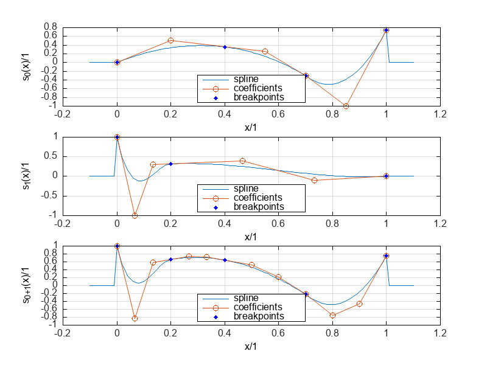
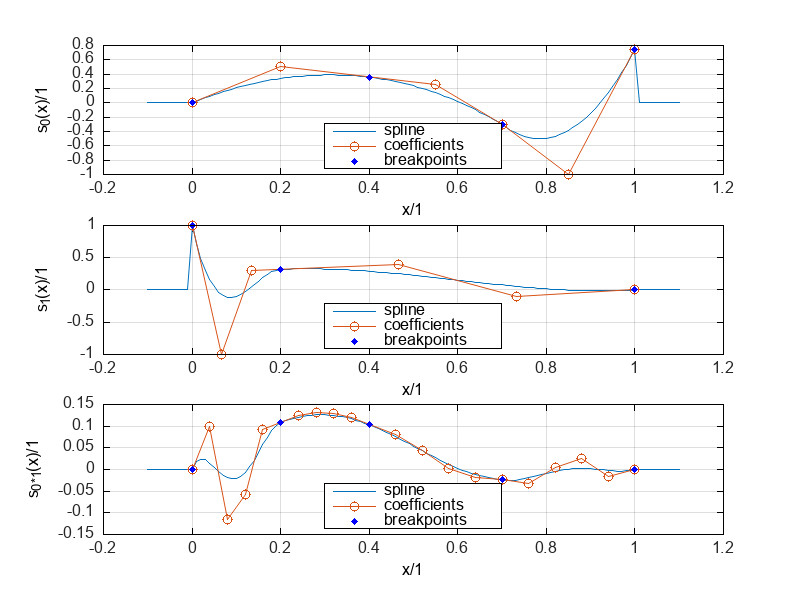

# Basis-splines

This project includes a C++ library implementing multi-dimensional polynomial splines in basis form and operations to form new splines that represent the derivative, integral, sum, and product of splines.
Among other things, polynomial splines are relevant for computer graphics and to solve semi-infinite programs resulting from optimal control problems.
For example [omg-tools](https://github.com/meco-group/omg-tools) provides a python framework for the formulation and solution of such problems.
This project provides a performant C++ implementation of relevant spline operations in this context.

## Installation

If you desire an integration in a CMake project you may utilize the *FetchContent* module.

```bash
FetchContent_Declare(
  basisSplines
  GIT_REPOSITORY https://github.com/phdorp/basis-splines.git
)
set(BUILD_TEST OFF)
set(BUILD_EXAMPLES OFF)
set(BUILD_DOCS OFF)
FetchContent_MakeAvailable(basisSplines)
link_libraries(basisSplines)
```

Otherwise you can directly include the header files in your project.
The project is complied with g++13.

## Examples

Run the examples with:

```bash
source setup.bash
./examples/launch.bash "example_name"
```

The examples rely on [Matplot++](https://github.com/alandefreitas/matplotplusplus) for plotting, so make sure to have [gnuplot](http://www.gnuplot.info/) installed.

### Basis functions

Basis splines are determine recursively on the knots

```math
\begin{aligned}
\mathbf{k}=\begin{bmatrix}\underbrace{\begin{matrix}\kappa_1&\kappa_1&\ldots&\kappa_1\end{matrix}}_{m_1}&\underbrace{\begin{matrix}\kappa_2&\kappa_2&\ldots&\kappa_2\end{matrix}}_{m_2}&\ldots&\kappa_{\breve{\mathbf{k}}}&\kappa_{\breve{\mathbf{k}}}\end{bmatrix}.
\end{aligned}
```

The knots are composed of the repeated breakpoints $`\kappa_i<\kappa_{i+1}`$, $`i=1,2,\ldots,\breve{\boldsymbol{\kappa}}`$.
The multiplicity $`m_i=\rho-\omega_i`$ of the $`i`$-th breakpoint determines the spline's order of continuity $`\omega_i`$.
The recursion's base case is the order $`\rho=1`$, considering $`n=1,2,\ldots,\breve{\boldsymbol{k}}-1`$ knot intervals [[1, Ch. IX eq. (11)]](#1)

```math
\begin{aligned}
b_{n,1,\mathbf{k}} =
    \begin{cases}
        1 & \text{if } k_n \leq t < k_{n+1}, \\
        0 & \text{otherwise.}
    \end{cases}
\end{aligned}
```

Higher orders $`\rho>1`$ are determined from lower orders, resulting in truncated power functions with $`l=1,2,\ldots,\breve{\boldsymbol{k}}-\rho`$ [[1, B-spline Prop. (i)]](#1)

```math
\begin{aligned}
b_{l,\rho,\mathbf{k}}(t)=\frac{t-k_l}{k_{l+\rho-1}-k_l}b_{l,\rho,\mathbf{k}}(t)+\frac{k_{l+\rho}-t}{k_{l+\rho}-k_{l+1}}b_{l+1,\rho,\mathbf{k}}(t).
\end{aligned}
```


The exemplary B-splines of order 3 with 3 breakpoints are found under *examples/basis.cpp*.

### Spline functions

Splines in basis form are a linear combination of basis functions weighted with the coefficients $`c_n`$ for $`n=0,1,\ldots,\breve{\mathbf{c}}-1`$ [[1, Def. (51)]](#1):

```math
\begin{aligned}
s(t)=\sum_{n=0}^{\breve{\mathbf{c}}-1}c_nb_{n,\rho,\mathbf{k}}(t).
\end{aligned}
```

The coefficients form a convex hull that contains the spline's graph.


The example in *examples/spline2d.cpp* shows 2 splines of order 3 and 4 breakpoints.

### Derivative

The spline derivative $`\dot{s}(t)=\frac{\mathrm{d}}{\mathrm{d}t}s(t)`$ has reduced order and continuity.
The derivative coefficients are determined from the original coefficients $`c_n`$ [[1, B-spline Prop. (viii)]](#1):

```math
\begin{aligned}
\dot{s}(t)=\frac{\mathrm{d}}{\mathrm{d}t}\sum_{n=0}^{\breve{\mathbf{c}}-1}c_nb_{n,\rho,\mathbf{k}}(t)=(\rho-1)\sum_{n=1}^{\breve{\mathbf{c}}-1}\frac{c_n-c_{n-1}}{k_n-k_{n-1}}b_{n,\rho-1,\mathbf{k}}(t).
\end{aligned}
```

Thus, the derivative is the result of a linear transformation of the coefficients $`\dot{s}(t)=\left(\mathbf{T}_{\dot{\mathbf{b}}}^{\mathbf{b}}\mathbf{c}\right)^\intercal b_{n,\rho-1,\mathbf{k}}(t)`$:

```math
\begin{aligned}
\mathbf{T}_{\dot{\mathbf{b}}}^{\mathbf{b}}=(\rho-1)
\begin{pmatrix}
\frac{1}{k_1-k_\rho}&\frac{1}{k_\rho-k_1}&0&\ldots&0&0\\
0&\frac{1}{k_2-k_\rho}&\frac{1}{k_\rho-k_2}&0&\ldots&0\\
\vdots&\vdots&\vdots&\ddots&\vdots&\vdots\\
0&0&0&\ldots&\frac{1}{k_{\breve{\mathbf{k}}-1}-k_{\breve{\mathbf{c}}}}&\frac{1}{k_{\breve{\mathbf{c}}}-k_{\breve{\mathbf{k}}-1}}\\
\end{pmatrix}.
\end{aligned}
```


The example fr differentiating a spline of order 3 is found under *examples/splineDeriv.cpp*.
The file *examples/splineDerivExplicit.cpp* shows the application of the transformation matrix.

### Integral

The spline integral $`s_\mathrm{I}(t)=\int_{\kappa_0}^t s(\tau)\mathrm{d}\tau`$ has increased order and continuity.
The transformation to the integral coefficients $`\mathbf{c}_{\mathrm{I}}`$ is derived from the derivative definition and yields [[1, Ch. X eq. (31)]](#1):

```math
\begin{aligned}
c_{{n+1},\mathrm{I}}=c_{n,\mathrm{I}}+\frac{1}{\rho}(k_{n+\rho}-k_n)c_n
\end{aligned}
```

Assuming an initial condition $`c_{0,\mathrm{I}}=0`$, the spline integral is also determined by a linear transformation of the coefficients $`s_\mathrm{I}(t)=\left(\mathbf{T}_{\mathbf{b}_\mathrm{I}}^{\mathbf{b}}\mathbf{c}\right)^\intercal b_{n,\rho+1,\mathbf{k}}(t)`$ with

```math
\begin{aligned}
\mathbf{T}_{\mathbf{b}_\mathrm{I}}^{\mathbf{b}}=
\begin{pmatrix}
0&0&0&\ldots&0\\
k_\rho-k_0&0&0&\ldots&0\\
k_\rho-k_0&k_{\rho+1}-k_1&0&\ldots&0\\
\vdots&\vdots&\ldots&\ddots&\vdots\\
k_\rho-k_0&k_{\rho+1}-k_1&k_{\rho+2}-k_2&\ldots&k_{\breve{\mathbf{k}}-1}-k_{\breve{\mathbf{c}}-1}\\
\end{pmatrix}.
\end{aligned}
```


The example for integrating a spline of order 3 is found under *examples/splineInteg.cpp*.
The file *examples/splinentegExplicit.cpp* shows the application of the transformation matrix.

### Sum and product

The sum and product of two splines $`s_\square(t)`$ and $`s_\triangle(t)`$ are exactly described by another spline.
The coefficients of the sum $`s_+(t)=s_\square(t)+s_\triangle(t)`$ and the product $`s_\times(t)=s_\square(t)\cdot s_\triangle(t)`$ are described implicitly by an interpolation:

```math
\begin{aligned}
s_+(\tau_{{j,+}})&=s_\square(\tau_{{j,+}})+s_\triangle(\tau_{{j,+}}),&j=0,1,\ldots,\breve{\mathbf{c}}_+-1,\\
s_\times(\tau_{{i,\times}})&=s_\square(\tau_{{i,\times}})\cdot s_\triangle(\tau_{{i,\times}}),&i=0,1,\ldots,\breve{\mathbf{c}}_\times-1.\\
\end{aligned}
```





The coefficients are also determined explicitly with two transformation matrices $`\mathbf{T}_{\mathbf{b}_+}^{\mathbf{b}_{\square}}`$ and $`\mathbf{T}_{\mathbf{b}_+}^{\mathbf{b}_\triangle}`$ in the sum case, and a single matrix in the product case $`\mathbf{T}_{\mathbf{b}_\times}^{\mathbf{b}_{\square}\odot\mathbf{b}_{\triangle}}`$ [[2, Property 2 and 3]]((#2)):

```math
\begin{aligned}
\mathbf{c}_+&=\mathbf{T}_{\mathbf{b}_+}^{\mathbf{b}_{\square}}\mathbf{c}_\square+\mathbf{T}_{\mathbf{b}_+}^{\mathbf{b}_\triangle}\mathbf{c}_\triangle,\\
\mathbf{c}_\times&=\mathbf{T}_{\mathbf{b}_\times}^{\mathbf{b}_{\square}\odot\mathbf{b}_{\triangle}}\left(\mathbf{c}_\square\otimes\mathbf{c}_\triangle\right).
\end{aligned}
```

Examples for the sum and product of splines are found under *examples/splineSum.cpp* and *examples/splineProd.cpp*.
The usage of the transformation matrices is shown in *examples/splineSumExpl.cpp* and *examples/splineProdExpl.cpp*.

### References

<a id="1">[1]</a>
C. Boor:
*A Practical Guide to Splines*.
1st ed. Vol. 27.
Applied Mathematical Sciences.
New York, NY, USA: Springer, Nov. 2001.
URL: https://link.springer.com/book/9780387953663.

<a id="2">[2]</a>
W. van Loock, G. Pipeleers, and J. Swevers:
“Optimal motion planning for differentially flat systems with guaranteed constraint satisfaction”.
In: *2015 American Control Conference (ACC)*.
July 2015, pp. 4245–4250.
DOI: 10.1109/ACC.2015.7171996.
